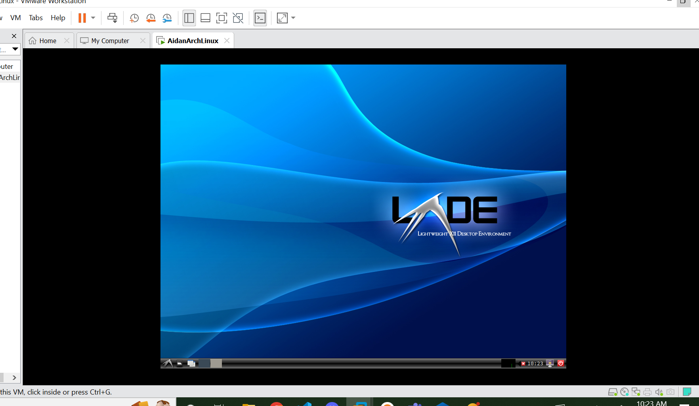

# Aidan Pohl Arch Linux Project
- For the first part of this project I followed the official [Arch Linux Wiki](https://wiki.archlinux.org/title/Installation_guide) guide on installation to set up the VM without a Desktop Enviroment
## Getting Started
- The first step in setting up an Arch Linux VM is obtaining a Arch Linux image and a hypervisor to create and run the actual virtual machine.
### Arch Linux Disk Image
- I navigated to the [Arch Linux download page](https://archlinux.org/download/) and obtained a version archlinux-2022.10.01-x86_64 disk image from one of the download links. After getting the completed image I needed to confirm the checksums matches between my download and the isted values to make sure my download went well.
### VMWare Workstation 16 Pro
- For the hypervisor I went with VMWare Workstation 16 Pro, because that is what the teacher reccomended. Our class was given product liscence keys for the software and downloaded the software installer from the [product webpage](https://customerconnect.vmware.com/downloads/details?downloadGroup=WKST-1624-WIN&productId=1038&rPId=91434&download=true&fileId=d60f20003600b70defb72215417aadee&uuId=0955ecde-af57-4a16-b32b-705972b3177c)
- Then I ran the sintaller to set up the hypervisor software on my laptop. During which, I needed to enter the liscence key we obntained earlier.
## Initial VM setup
### Installing the Disc Image in VMWare
- First I opened the VMWare Workstation program (as one does)
- Once the Home window was open I navidated to the File tab and Clicked on the option for "New Virtual Machine...". This opened a new window for the VM Wizard.
- On the first page I selected a Typical configuration as i wasn intending on getting too fancy with it. Hitting Next to continue.
- Then I selected the prieviously downloaded ISO (disk image file) for ArchLinux for the Installer disc image file. (Had to Browse for it in my file directory)
- Because the OS wasnt automatically detected, I had to manually declare it was a Linux distribution selecting "Other Linux 5.x kernal 64-bit" as the version.
- Then I named the VM and created a folder to store it in.
- Finally for the wizard I set the size of the VM to 8 GB and a single file, as this VM is mainly just for the project of setting up the VM.
- I went int customize the hardware, giving the Vm 2 GB of ram and setting the loader to UEFI instead of BIOS
- This created a new VM in VMWare Workstations Home Screen.

### Configuring the ISO
- Keyboard layout.
    - Step one was to make sure that the vm knew which keys meant which characters so i needed to select the proper keyboard layout.
    - using `# ls /usr/share/kbd/keymaps/**/*.map.gz` I was able to get a list of the available layouts
    - But since I am using an American keyboard I kept the default US keylayout.
- Verfifying boot mode.
    - I tried booting the VM in EFI mode and to confirm that I ran the command: `# ls /sys/firmware/efi/efivars/`
    -As a series of files were printed this confiermed that i was using EFI mode
### Acessing the Internet
- Using `# ip link` I could check my current connectivity, prior to strictly setting up an internet connection I had two link entries.
    - One, an `lo` link was merely a part of the virtual loopback interface and could be safely ignored
    - The other `ens33` seemed to be the default internet interface. I left it alone for now.
- i tested the connection by typing `# ping archlinux.com` I sent a handful of pings and got responsed confirming they were recieved. This confirms I was connected to the internet.
### Updating systemclock
- using `# timedatectl status` I saw that the system clock was downloaded from the internet but that it was several hours ahead, probably in mean greeenwich time.
- I brought this back to my own Central Timezone using the command `# timedatectl set-timezone America/Chigago`
### Disc Partitioning
- First step is to see the connected hard drives that I could use for partitioning. I used the command `# fdisk -l` to find them.
    - The first disk was the /dev/sda disk which is my empty 20GB with no partitions for the future VM
    - The oher one was the /dev/loop that held the ISO I was currently looking at.
- What I needed to do was partifition the first disk to properly use the second one to install. To do that i first entered the partition table for /dev/sda using `# fdisk /dev/sda`
- Now inside the tool, it showed that there infact was no partition table, so I needed to create the partitions.
- Given im running the VM in UEFI i needed a boot partition and a root partition
- the Boot partition needed to be at the beginning and take up at least 300MB but not too much, so using the tool:
    1. `# n` to make a new partition
    2. `# p` to make it a primary partition
    3. `# 1` to make it the first partition
    3. just hit enter as the default is at the beginning of the memory (2048)
    4. `# +500M` to make it have a size of 500MB which is larger than the strict minimum but leaves plenty of space for the root
    - This makes the first partition
- The Root partition will hold the rest of the VM being storage and whatnot
    1. `# n` to make a new partition
    2. `# p` to make it a primary partition
    3. `# 2` to make it the second partition
    4. just hit enter as the default is at the beginning of the memory (2048)
    5. And hit enter again as the default value will have the partition fill up the remaining space.
    - This makes the second partition
- Once both are made i use `# w` to write into the virtual hard drive
- We also need to format the partitions so that they are the right type. First we need to go back into `#fdisk /dev/sda`
    - The first partition /dev/sda1 is our boot partition so we neet to change its type from Linux to UEFI
        1. `# t` to tell the tool we are changing a partitions type
        2. `# 1` to select our first partition
        3. `# EF` to tell the partition to swap types to UEFI
- I then used `# w` to write my new changes and preserve them
### Formatting Partitions
- Now I needed to give each partition a file system, so that they know how to organize the incoming data.
- For the EFI system partition I formated it to FAT32 using the command `# mkfs.fat -F 32 /dev/sda1`
- The Root partition will be using the Ext4 file system, so i used the command `# mkfs.ext4 /dev/sda2`
### Mounting file systems
- now we need to mount the file systems which basicaly attackes them to the rudimentory system and allows them to be acessed.
- The root volume needs to be mounted to `/mnt` so we use the command `# mount --mkdir /dev/sda2 /mnt` which will both create the directory /mnt and mount the root volume to it
- The UEFI boot partition will now be mounted to a folder within `/mnt` called `/mnt/boot` so I used the command `# mount --mkdir /dev/sda1 /mnt/boot` to make said folder and mount the boot partition to it.
## Installation
### Mirrors (Prelude)
- All the packages I needed to install are kept on verious mirror servers defined in `/etc/pacman.d/mirrorlist`. But as I currently did not have a text editor, I needed to wait until i downloaded some packages
### Packages
- Speaking of which, there are several critical packages i needed to install so that when the VM is set up, I have access to varaious tools and the internet to continue working.
- The base package contains the Linux kernal and firmware, so given I was making an ArchLinux VM it only made sense to use it. `# pacstrap -K /mnt base linux linux-firmware` was the command used to install the package.
- For a text editor i went with nano as i was familiar with it. I used the command `# pacstrap -K /mnt nano` to isntall.
- And I also wanted to be able to use manuals so the provided packages `man-db`,`man-pages`, and `texinfo` seemed like intelligent options. I used the following commnad : `# pacstrap -K man-db man-pages texinfo`
- More importantly however I needed a networking software so i can install things from the internet once Im done with the ISO, including downloading additional packages. I installed both `iproute2` and `networkmanager` to help with that.
- Everything else I deemed not neccessary to the initial build or can be installed later assuming the packeges installed correctly.
### Configuring the System
- I created an `fstab` file for UUID definitions
`# genfstab -U /mnt >> /mnt/etc/fstab`
- I then changed the root of the system into our future VM using `# arch-chroot /mnt`
- Once inside the system I needed to update the time zone and localization. Once again because Im in the Central time zone my commands reflects that:
    - `# ln -sf /usr/share/zoneinfo/America/Chicago /etc/localtime` to set the timzone.
    - `# hwclock --systohc` to generate `/etc/adjtime`
    - using `nano` I edited `/etc/locale.gen` to uncomment `en_US.UTF-8 UTF-8` as that is my locale, then generated the locales using `# locale-gen`
    - Then I used the commands `# echo "LANG=en_US.UTF-8" > /etc/locale.conf` to make the config file with the appropriate LANG variable.
- for the machines hostname I used `# echo "archaidan" > /etc/hostname`
### Root password
- Finally I set a root password using `# passwd`
### Boot Loader
- Now I've reached the end of the set up its time to load into the actual VM OS, but a couple last things need to be done
- Because I have an Intel CPU I needed to enable microcode updates.
    - I  installed the `intel-ucode` package using `# pacman -S intel-ucode`
- As a boot manager i chose GRUB so i needed to install the packages `grub` and `efibootmgr`
`# pacman -S efibootmgr grub`
- I then created a directory for the boot manager using `# mkr /boot/EFI/ /boot/EFI/GRUB/`
- Then used the following command to install the GRUB directory: `# grub-install --target=x86_64-efi --efi-directory=/boot --bootloader-id=GRUB`
- After i used the `# grub-mkconfig -o /boot/grub/grub.cfg` command to generage the GRUb bootloader config file
## Reboot
-Finally ready to try out the installation i exited the chroot enciroment using `# exit`
- I then used `# reboot` to restart the system.
# LXDE
- `systemctl start NetworkManager` gets connection to internet
- `systemctl enable NetworkManager` allows NetworkManager to start on boot
## Dependencies
- install package group `pacman -Syu lxde`
- confirm all
## setting up desktop enviro to load
- install `xorg-xinit` (xinit)

- `chmod +x ~/.xinitrc` make `~/.xinitrc` executable
- add `exec startlxde` to `~/.xinitrc` makes the DE run on `startx`

